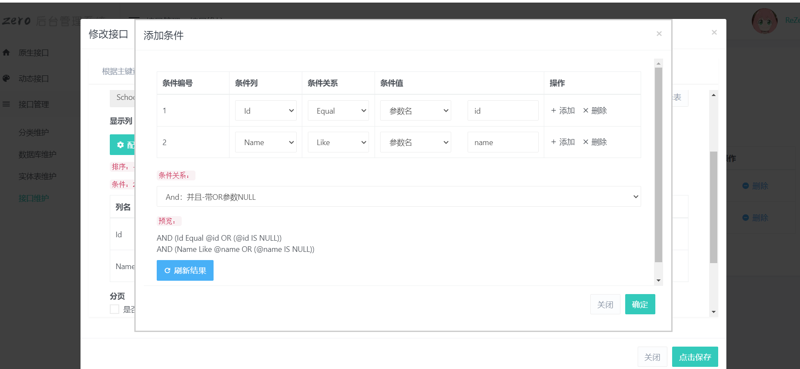
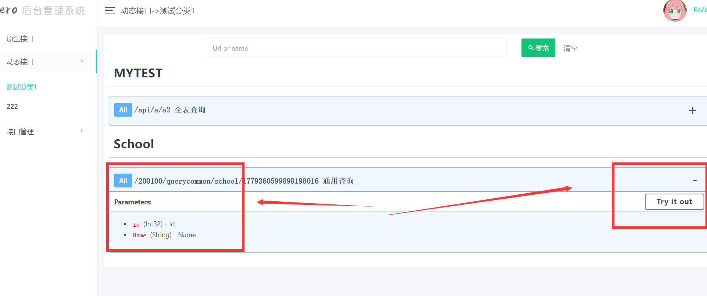
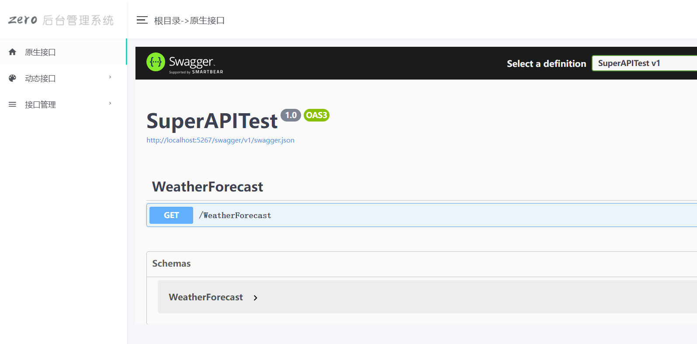
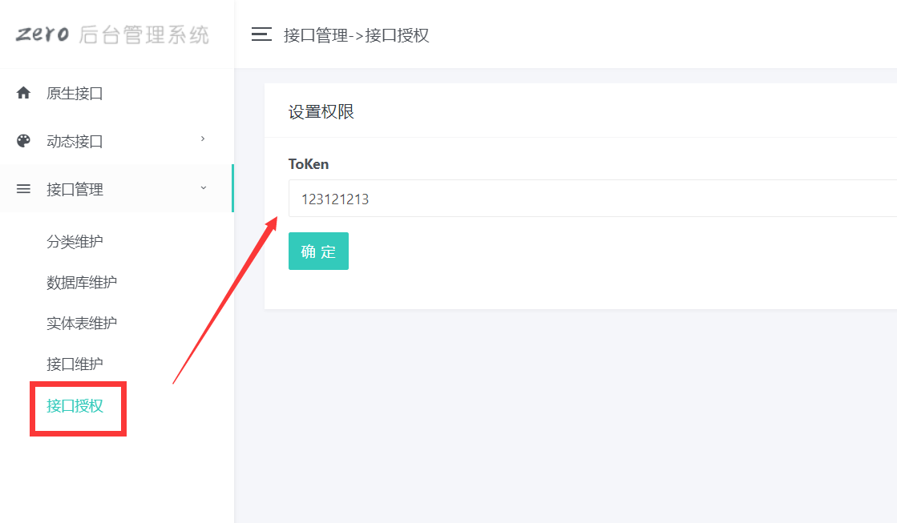
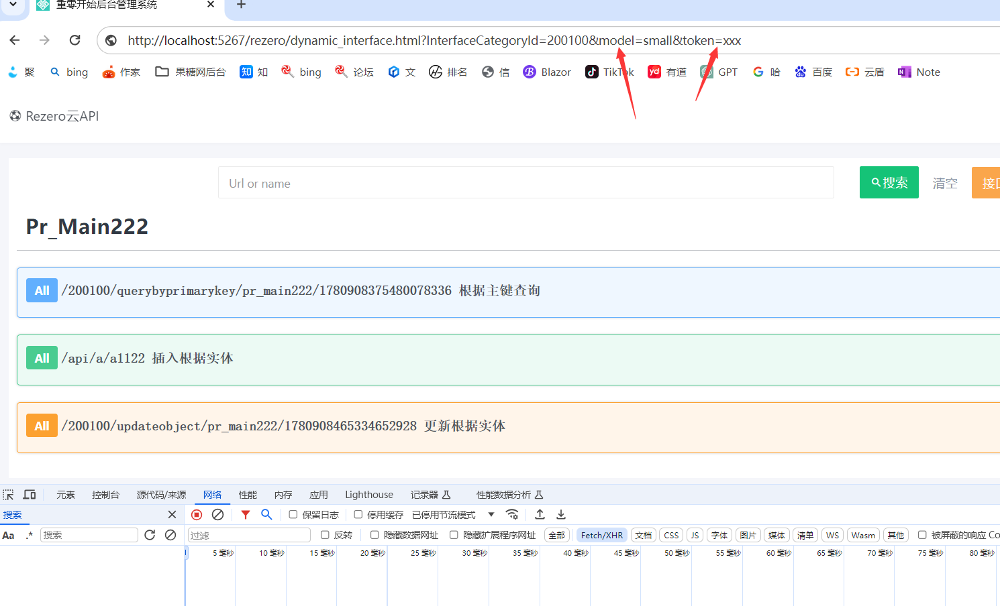
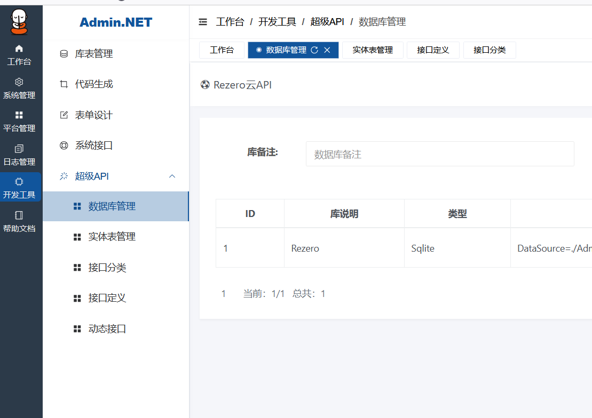

# QQ群
群号：878157334   先加 sqlsugar群和rezero是同一个作者
# 一、ReZero说明
是一款.NET中间件,让你无需写任何代码也能实现CRUD，也可以发布成exe独立使用于非.NET用户
创建接口

查看创建后的接口


数据库支持
Sqlite 、 MySql 、 SqlServer 、 PgSQL 、Oracle 、人大金仓（默认模式）、 达梦

# 二、功能介绍
在线数据库和表
在线创建API接口 、接口文档 和接口调试

 
# 三、非.NET用户教程
通过下载EXE运行
https://gitee.com/sunkaixuan/ReZero/releases/tag/1.0.0.16


# 四、.NET用户教程

## 4.1 Nuget安装
```cs
Rezero.Api 
``` 
## 4.2 一行代码配置
新建一个.NET6+ WEB API
只需要注入一行代码就能使用 Rezero API

```cs
/***对现有代码没有任何影响***/

//注册：注册超级API服务
builder.Services.AddReZeroServices(api =>
{
    //启用超级API
    api.EnableSuperApi();//默认载体为sqlite ，有重载可以配置数据库

});
//写在builder.Build前面就行只需要一行
var app = builder.Build();

```
## 4.3使用ReZero
启动项目直接访问地址就行了
http://localhost:5267/rezero 


## 4.4 jwt授权

```cs
//注册：注册超级API服务
builder.Services.AddReZeroServices(api =>
{
    //启用超级API
    api.EnableSuperApi(new SuperAPIOptions()
    { 
        InterfaceOptions = new InterfaceOptions()
        { 
            AuthorizationLocalStorageName = "jwt",

            //授权拦截器 
            SuperApiAop = new JwtAop()
        }
    }); ;

});
public class JwtAop : DefaultSuperApiAop
{
    public async override Task OnExecutingAsync(InterfaceContext aopContext)
    {
 
         //注意：html页面的url里面加token=xxx可以让内部接口也支持jwt授权
         var authenticateResult = await aopContext.HttpContext.AuthenticateAsync(JwtBearerDefaults.AuthenticationScheme);
         if (!authenticateResult.Succeeded)
         { 
             throw new Expception("Unauthorized"); 
         }
        await base.OnExecutingAsync(aopContext);
    }
    public async override Task OnExecutedAsync(InterfaceContext aopContext)
    {
        await base.OnExecutedAsync(aopContext);
    }
    public async override Task OnErrorAsync(InterfaceContext aopContext)
    {
        await base.OnErrorAsync(aopContext);
    }
}

```
界面配置ToKen

## 4.5 集成到自已系统
只要在url加上model=small 就会隐藏头部菜单和左边的菜单<br>
如果跨域或者端口需要url加token这样可以让内部接口也支持jwt授权


效果图如下


## 4.6统一返回结果
如果不喜欢默认返回格式我们可以自定义返回格式

```cs
builder.Services.AddReZeroServices(api =>
{
   
    api.EnableSuperApi(new SuperAPIOptions()
    {
        InterfaceOptions = new InterfaceOptions()
        {
            //MergeDataToStandardDtoFunc 设置统一返回格式
            MergeDataToStandardDtoFunc = dto =>
            {

                if (dto is ErrorResponse error)
                {
                    return new { isSuccess = false, data = error.message };
                }
                else if (dto is bool b)
                {
                    return new { isSuccess = b, data = b };
                }
                //更多逻辑自已处理这儿只是一个示例
                return new { isSuccess = true, data = dto };
            }
        }
    });

});
```

# 五、打赏作者

首先感谢大家 ， 项目启动前就有人赞助开发了 

工作量很大 ，功能复杂 ，对标的是收费软件，相信未来将会成长的很好


