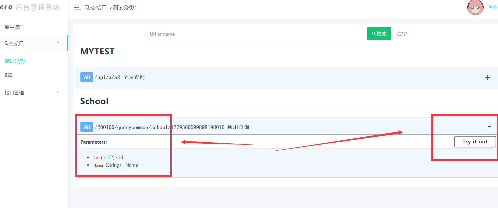

# ReZero
是一款.NET中间件,让你无需写任何代码也能实现CRUD，也可以发布成exe独立使用于非.NET用户 

## 功能
在线数据库和表
在线创建API接口 、接口文档 和接口调试
## .NET版本
.NET6+ WEB API

# 安装
## NUGET安装

```cs
Rezero.Api 
``` 
## 只需要行代码
 新建一个.NET6+ WEB API
 只需要注入一行代码就能使用 Rezero API

```cs
//注册：注册超级API服务
builder.Services.AddReZeroServices(api =>
{
    //启用超级API
    api.EnableSuperApi();

});
//写在builder.Build前面就行只需要一行
var app = builder.Build();

```
# 使用ReZero
启动项目直接访问地址就行了
http://localhost:5267/rezero 
 
# 功能预览

