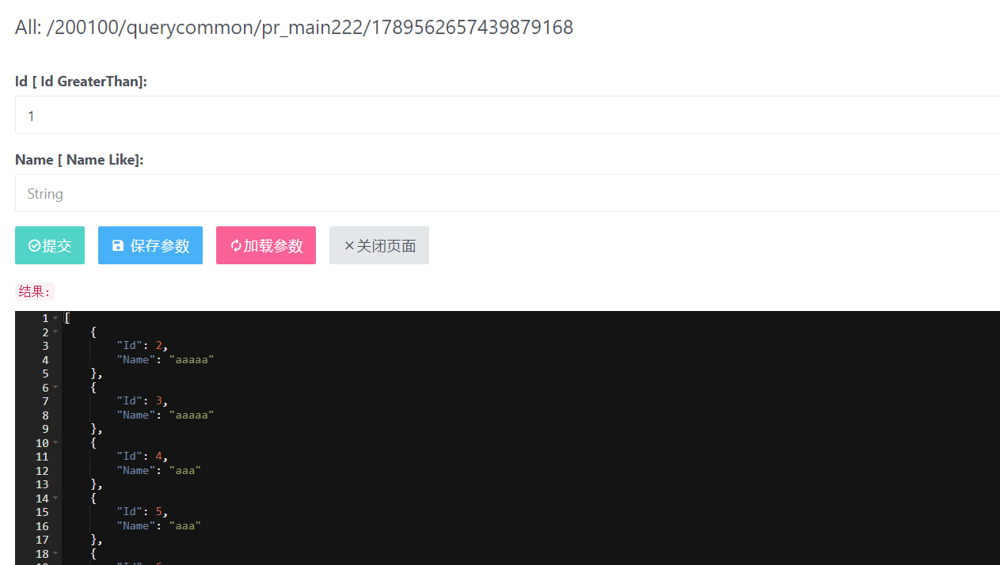
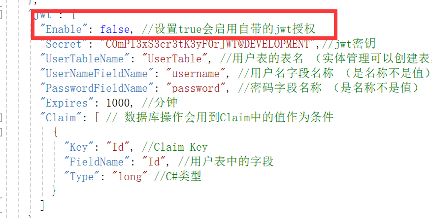
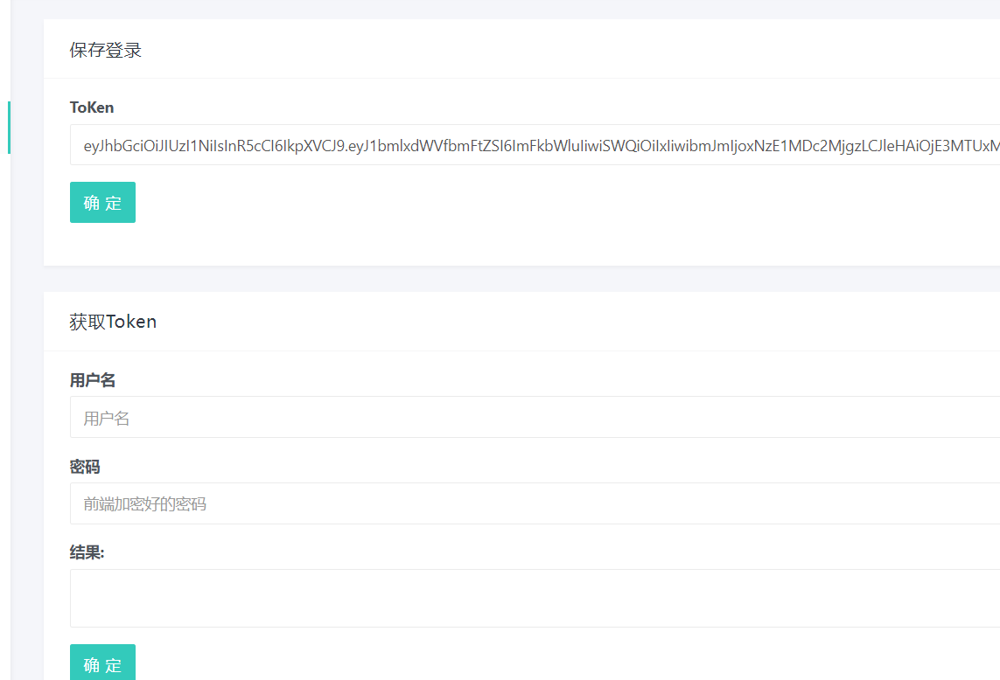
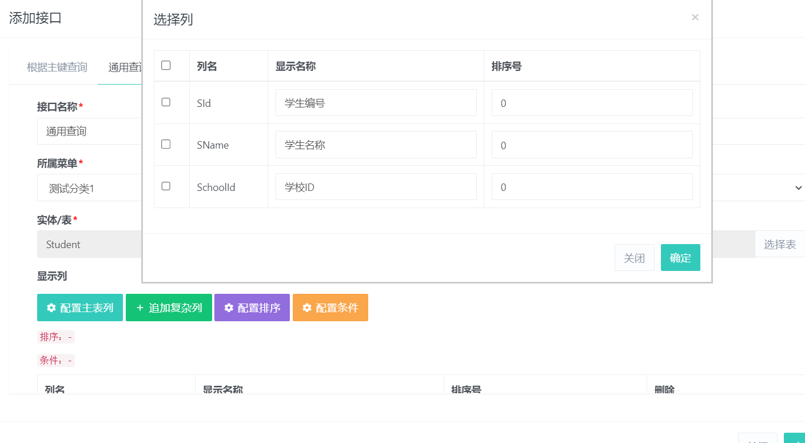
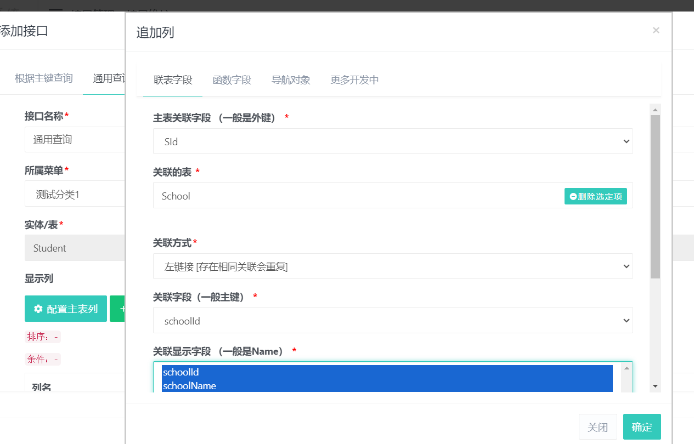
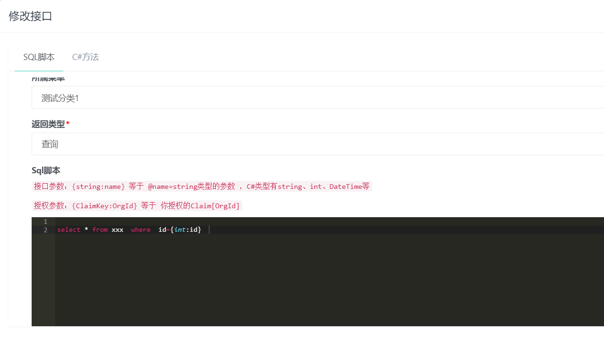
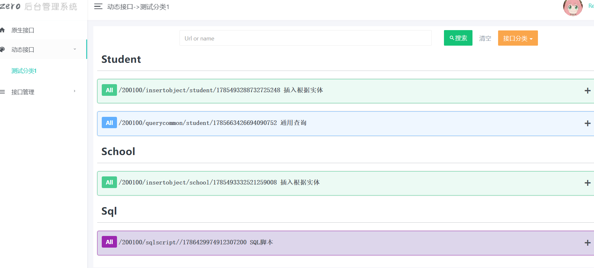
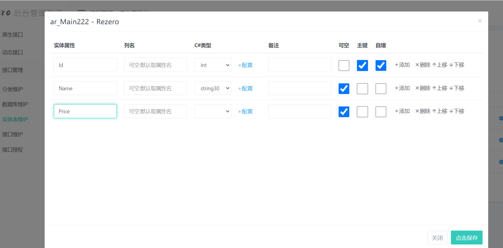
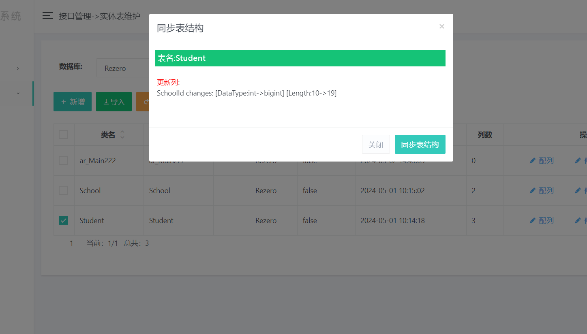

# Rezero API 功能
Rezero是一款.NET中间件,无需写代码也能实现CRUD，无破坏性，可以集成到任何.NET API项目，非.NET用户可以用发布好的exe文件 

1、界面功能：创建接口 、建库、建表 、生成接口、设置授权、接口文档、调试接口等等都不需要写代码<br>
2、可以创建自已的用户表，而不是固定的表实现授权<br>
3、支持非.NET用户使用，比如你是前端 GO JAVA PHP也可以使用打包好的EXE
4、.NET6+的API项目都可以一行代码集成到自已项目中，对以前的逻辑没有破坏性<br>
5、.NET用户也可以用来构建API程序，支持模块化、授权、IOC（支持属性注入）、自动生成接口、ORM、工作单元、多租户等等<br>

## 1.1 官方文档
https://www.donet5.com/Doc/32/2580

## 1.2 加群交流
qq群号：472534707

## 1.3 功能截图
### 创建接口


### 查看创建后的接口


### 在线调试接口



# 二、数据库支持
Sqlite 、 MySql 、 SqlServer 、 PgSQL 、Oracle 、人大金仓（默认模式）、 达梦

 
# 三、非.NET用户教程
通过下载EXE运行
https://gitee.com/DotNetNext/ReZero/releases


# 四、.NET用户教程

## 4.1 Nuget安装
```cs
Rezero.Api 
``` 
## 4.2 一行代码配置
新建一个.NET6+ WEB API
只需要注入一行代码就能使用 Rezero API

```cs
/***对现有代码没有任何影响***/

//注册：注册超级API服务
builder.Services.AddReZeroServices(api =>
{
    //启用超级API
    //有重载可换json文件
    var apiObj = new ReZero.SuperAPI.SuperAPIOptions();
    //注册DLL
    apiObj!.DependencyInjectionOptions = new ReZero.SuperAPI.DependencyInjectionOptions(Assembly.GetExecutingAssembly());
    //启用超级API
    api.EnableSuperApi(apiObj);

});
//写在builder.Build前面就行只需要一行
var app = builder.Build();

```
## 4.3使用ReZero
启动项目直接访问地址就行了
http://localhost:5267/rezero 


## 4.4 授权
打开appsettings.json配置jwt参数

界面完成登录
 
 

## 4.5 集成到自已系统
只要在url加上model=small 就会隐藏头部菜单和左边的菜单<br>
如果跨域或者端口需要url加token这样可以让内部接口也支持jwt授权


效果图如下


## 4.6统一返回结果
如果不喜欢默认返回格式我们可以自定义返回格式

```cs
//注册ReZero.Api
builder.Services.AddReZeroServices(api =>
{
  
    //有重载可换json文件 (断点看一下apiObj.DatabaseOptions.ConnectionConfig有没有字符串进来)
    var apiObj = SuperAPIOptions.GetOptions("rezero.json"); 
      
    .....省略........
     
    //只看这一行 （不要new InterfaceOptions会把上面配置清空,尽量用apiObj.InterfaceOptions.xxx）
    apiObj.InterfaceOptions.MergeDataToStandardDtoFunc=dto =>
    {
 
                if (dto is ErrorResponse error)
                {
                    return new { isSuccess = false, data = error.message };
                }
                else if (dto is bool b)
                {
                    return new { isSuccess = b, data = b };
                }
                //更多逻辑自已处理这儿只是一个示例
                return new { isSuccess = true, data = dto };
      };
      
  
    //启用超级API
    api.EnableSuperApi(apiObj);
  
});

``` 
## 4.7 AOP实现日志记录 或者 授权（不用自带的JWT）

```cs
//注册ReZero.Api
builder.Services.AddReZeroServices(api =>
{
    //有重载可换json文件
    var apiObj = SuperAPIOptions.GetOptions();
    //IOC业务等所有需要的所有集程集
    apiObj!.DependencyInjectionOptions = new DependencyInjectionOptions(assemblyList);
    apiObj.InterfaceOptions.SuperApiAop = new MyAop();//这一行配置AOP
   //启用超级API
   api.EnableSuperApi(apiObj); 

}); 

//自定义一个AOP类
public class MyAop : DefaultSuperApiAop
{
    public override Task OnExecutingAsync(InterfaceContext context)
    {
        //也可以用AOP实现JWT授权，不用使自带的JWT授权，适用于已存在JWT的情况
        //JWT验证
        //context.AttachClaimToHttpContext("Claim", 1);
        return base.OnExecutingAsync(context);
    }
}
```


# 五、功能预览
## 预览1：查询配置显示列

## 预览2：查询配置联表
 
## 预览3：SQL直接生成接口

## 预览4：配置完显的接口列表

## 预览5: 创建实体

## 预览6: 更新表结构对比


# 六、打赏作者

首先感谢大家 ， 项目启动前就有人赞助开发了 

工作量很大 ，功能复杂 ，对标的是收费软件，相信未来将会成长的很好

坚持用开源做出高品质的免费软件


# 七、详细文档
https://www.donet5.com/Doc/32/2580
